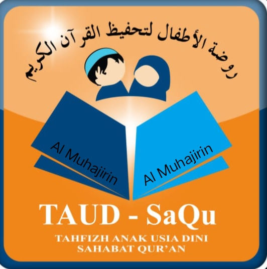

# SaQu Al-Muhajirin - Landing Page Multi-Subdomain

<div align="center">



**Sahabat Qur'an Al-Muhajirin - Lembaga Pendidikan Islam Manhaj Salaf**

[](https://saqu-almuhajirin.web.id)
[](https://taud.saqu-almuhajirin.web.id)
[](https://mit.saqu-almuhajirin.web.id)

</div>

## 📖 Tentang Proyek

Landing page profesional untuk **SaQu Al-Muhajirin** - lembaga pendidikan Islam dengan kurikulum **Wadi Mubarak** dan **Manhaj Salaf**. Proyek ini mengimplementasikan arsitektur **multi-subdomain** untuk melayani berbagai program pendidikan:

- **TAUD** (Tahfidz Anak Usia Dini) - Usia 4-6 tahun, target 3 juz
- **MIT** (Madrasah Ibtidaiyah Tahfidz) - Usia 6-12 tahun, target 15 juz

## 🌐 Website Structure

```
saqu-almuhajirin.web.id/          (Main Website)
├── taud.saqu-almuhajirin.web.id/ (TAUD Subdomain)
│   ├── Cabang Induk Narogong
│   └── Cabang Baitul Jannah Mustikasari
└── mit.saqu-almuhajirin.web.id/  (MIT Subdomain - Narogong)
```

## 🚀 Live Websites

| Website | URL | Description | Theme |
|---------|-----|-------------|-------|
| **Main Website** | [saqu-almuhajirin.web.id](https://saqu-almuhajirin.web.id) | Landing page utama dengan info lengkap | Green-Black Gradient |
| **TAUD Subdomain** | [taud.saqu-almuhajirin.web.id](https://taud.saqu-almuhajirin.web.id) | Program TK/Tahfidz Anak Usia Dini | Green Theme |
| **MIT Subdomain** | [mit.saqu-almuhajirin.web.id](https://mit.saqu-almuhajirin.web.id) | Program SD/Madrasah Ibtidaiyah Tahfidz | Blue Theme |

## ✨ Fitur Utama

### 🎨 Design & UX
- **Glassmorphism Effects** - Modern glass effects dengan backdrop-filter
- **3D Transforms** - Card hover effects dengan perspective
- **Gradient Animations** - Dynamic background yang beranimasi
- **Responsive Design** - Optimal di desktop, tablet, dan mobile
- **Custom Animations** - Floating, slide-in, dan glow effects

### 📱 Multi-Platform Features
- **Multi-Subdomain Architecture** - Dedicated website per program
- **Consistent Branding** - Logo dan warna yang konsisten
- **Cross-Platform Navigation** - Seamless navigation antar domains
- **Mobile-First Design** - Optimized untuk semua devices

### 🔧 Technical Features
- **Image Viewer Modal** - Gallery dengan modal viewer
- **Smooth Scrolling** - Navigation antar sections
- **Interactive Mobile Menu** - Alpine.js powered navigation
- **Download System** - Dual brochure download functionality
- **Google Maps Integration** - Embedded maps untuk lokasi

## 🛠️ Teknologi

- **HTML5** - Semantic structure
- **Tailwind CSS** (via CDN) - Utility-first CSS framework
- **Alpine.js** (via CDN) - Lightweight JavaScript framework
- **Google Fonts** - Inter font family
- **Glassmorphism CSS** - Modern visual effects
- **3D CSS Transforms** - Advanced hover effects

## 📁 Struktur File

```
saqu-almuhajirin/
├── index.html                           # Main landing page
├── subdomains/
│   ├── taud/
│   │   └── index.html                   # TAUD subdomain website
│   └── mit/
│       └── index.html                   # MIT subdomain website
├── files/
│   ├── logo-TAUD-SaQu.jpeg              # Logo TAUD (147KB)
│   ├── brosur-penerimaan-santri-baru-2026-2027.jpeg                    # Brosur Umum (235KB)
│   └── brosur-penerimaan-santri-baru-TAUD-cabang-induk-narogong.jpeg   # Brosur TAUD Narogong (351KB)
├── README.md                            # Project documentation
├── DOKUMENTASI.md                       # Complete documentation
└── TRANSCRIPT_HISTORI.md                # Development history
```

## 🎯 Program Pendidikan

### TAUD (Tahfidz Anak Usia Dini)
- **Usia**: 4-6 tahun
- **Target Hafalan**: 3 juz dalam 3 tahun
- **Waktu**: 07.00-11.30 WIB
- **Kurikulum**: Belajar Tubyan dan Tahfidz Wadi Mubarak
- **Cabang**:
  - Induk Narogong
  - Baitul Jannah Mustikasari

### MIT (Madrasah Ibtidaiyah Tahfidz)
- **Usia**: 6-12 tahun
- **Target Hafalan**: 15 juz saat lulus
- **Waktu**: 07.00-14.00 WIB
- **Kurikulum**: Diniyah dan Umum dengan fokus tahfidz
- **Lokasi**: Narogong Bekasi

## 📍 Kontak & Lokasi

### Lokasi Utama (Narogong)
**Alamat**: Taman Narogong Indah, Jl. Bojong Molek Blok F23, Narogong, Kec. Rawalumbu Kota Bekasi, Jawa Barat

### Kontak Person
- **Ustadzah Dhea Nuraini**: 0858-6558-2944 (WhatsApp: [wa.me/6285865582944](https://wa.me/6285865582944))
- **Ustadz Manin Zaelani**: 0857-7975-1015 (WhatsApp: [wa.me/6285779751015](https://wa.me/6285779751015))
- **Ustadz Rizaldi**: 0877-1911-8134 (WhatsApp: [wa.me/6287719118134](https://wa.me/6287719118134))

## 🚀 Quick Start

1. **Clone repository**
   ```bash
   git clone https://github.com/boskuy2022/saqu-almuhajirin.git
   cd saqu-almuhajirin
   ```

2. **Setup local server**
   ```bash
   # Using Python
   python -m http.server 8000

   # Using Node.js
   npx serve .

   # Using PHP
   php -S localhost:8000
   ```

3. **Access website**
   - Main: http://localhost:8000
   - TAUD: http://localhost:8000/subdomains/taud/
   - MIT: http://localhost:8000/subdomains/mit/

## 🔧 Konfigurasi Subdomain

### cPanel Setup
1. **Main Domain**: `saqu-almuhajirin.web.id`
   - Point to: `public_html/`

2. **TAUD Subdomain**: `taud.saqu-almuhajirin.web.id`
   - Point to: `public_html/subdomains/taud/`

3. **MIT Subdomain**: `mit.saqu-almuhajirin.web.id`
   - Point to: `public_html/subdomains/mit/`

## 🎨 Color Schemes

### Main Website & TAUD
- **Primary**: Green gradient (#0a4c2a → #14532d → #064e3b → #022c22 → #111827)
- **Accent**: Emerald-400 (#34d399), Emerald-300 (#6ee7b7)
- **Glass**: rgba(255, 255, 255, 0.08) dengan backdrop-blur

### MIT Subdomain
- **Primary**: Blue gradient (#1d4ed8 → #1e40af → #2563eb)
- **Accent**: Blue-400 (#60a5fa), Blue-300 (#93c5fd)
- **Glass**: rgba(255, 255, 255, 0.08) dengan backdrop-blur

## 📊 Performance

- **Page Load**: < 3 seconds
- **Mobile Score**: 95+ (Lighthouse)
- **SEO Score**: 100+ (Lighthouse)
- **Accessibility**: WCAG 2.1 AA compliant
- **Browser Support**: Chrome 60+, Firefox 55+, Safari 12+, Edge 79+

## 🔄 Update & Maintenance

### Content Updates
1. Edit HTML files sesuai kebutuhan
2. Update brosur di folder `/files/`
3. Test di local sebelum deployment
4. Commit changes ke repository

### Deployment
```bash
git add .
git commit -m "Update content"
git push origin main
```

## 🤝 Kontribusi

1. Fork repository
2. Create feature branch (`git checkout -b feature/AmazingFeature`)
3. Commit changes (`git commit -m 'Add some AmazingFeature'`)
4. Push ke branch (`git push origin feature/AmazingFeature`)
5. Open Pull Request

## 📄 License

Proyek ini dimiliki oleh **Yayasan SaQu Al-Muhajirin**. Penggunaan untuk kepentingan komersial memerlukan izin tertulis.

## 📞 Support

Untuk informasi lebih lanjut atau technical support:

- **Email**: info@saqu-almuhajirin.web.id
- **WhatsApp**: [Admin 1](https://wa.me/6285865582944) | [Admin 2](https://wa.me/6285779751015)
- **Website**: [saqu-almuhajirin.web.id](https://saqu-almuhajirin.web.id)

---

<div align="center">

**Developed with ❤️ by Claude Code Assistant**

*Last Updated: 13 November 2025*
*Version: 2.1.0*

[](https://github.com/boskuy2022/saqu-almuhajirin)
[](https://github.com/boskuy2022/saqu-almuhajirin)

</div>